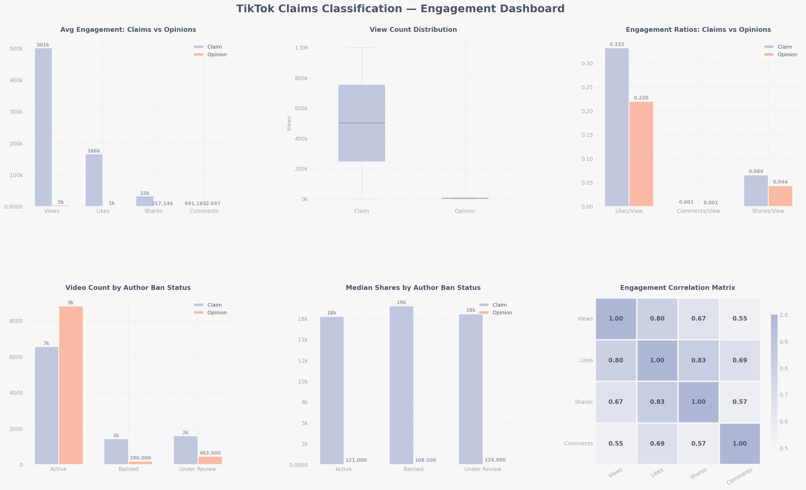
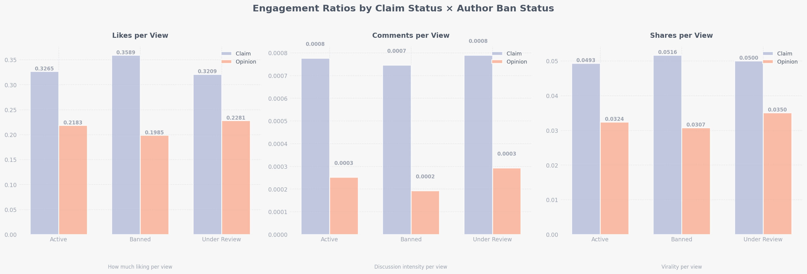
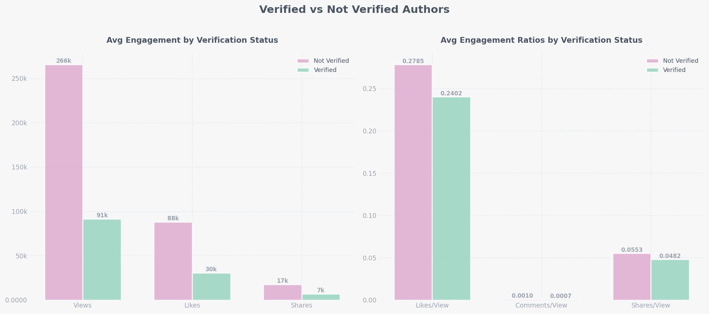
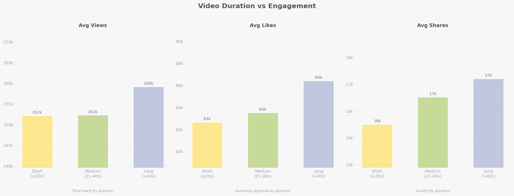

# TikTok Claims Classification — Detailed Findings

## Dataset Overview

| Attribute | Value |
|-----------|-------|
| Total records | 19,382 |
| Records after null removal | 19,084 |
| Missing values | 298 rows (1.5%) across all engagement columns |
| Features | 12 raw → 8 engineered |
| Target balance | Claim: 9,608 (50.4%) · Opinion: 9,476 (49.6%) |

**Categorical breakdown**

| Verified Status | Count | Author Ban Status | Count |
|----------------|-------|-------------------|-------|
| Not verified | 18,142 (93.6%) | Active | 15,663 (80.8%) |
| Verified | 1,240 (6.4%) | Under review | 2,080 (10.7%) |
| | | Banned | 1,639 (8.5%) |

---

## Finding 1 — Claims Drive Massively Higher Engagement

Claim videos outperform opinion videos across every raw engagement metric by an order of magnitude.

| Metric | Claim (avg) | Opinion (avg) | Ratio |
|--------|------------|---------------|-------|
| Views | 501,029 | 4,956 | ~101× |
| Likes | 171,428 | 1,090 | ~157× |
| Shares | 33,118 | 218 | ~152× |
| Comments | 691 | 3 | ~230× |

**Median shares:** Claim = 17,998 · Opinion = 121 — a **149× gap** that persists even after removing outlier influence.  
**Median comments:** Claim = 286 · Opinion = 1 — a **286× gap**.

The boxplot (top-centre) shows claims have a dramatically wider view-count distribution, with the majority of high-view outliers belonging to claim videos. Opinion views cluster tightly near zero by comparison.

---

## Finding 2 — Engagement Ratios Confirm Quality Signal, Not Just Scale

Even when normalising for views (removing the popularity effect), claim videos attract proportionally more interaction:

| Ratio | Claim | Opinion | Difference |
|-------|-------|---------|------------|
| Likes / View | 0.3316 | 0.2198 | +51% |
| Comments / View | 0.0014 | 0.0005 | +180% |
| Shares / View | 0.0659 | 0.0437 | +51% |

These normalised ratios mean claim content is not only reaching more people — each viewer is significantly more likely to engage with it.

The chart shows that this ratio advantage holds across all author ban categories (active, under review, banned), indicating the signal is structural and not driven by a particular author subset.

---

## Finding 3 — Author Ban Status Correlates with Claim Content

Authors who are banned or under review are overwhelmingly associated with claim videos:

| Claim Status | Active | Under Review | Banned |
|-------------|--------|--------------|--------|
| Claim | 6,566 | 1,603 | 1,439 |
| Opinion | 8,817 | 463 | 196 |

Claim videos account for **100% of banned-author content** in proportion terms (1,439 vs 196 opinion videos among banned authors). Among under-review authors, claims represent **78% of videos** vs only **34% for active authors**.

Average views by ban status also reveal that banned/under-review accounts generate significantly more engagement than active accounts:

| Ban Status | Avg Views | Median Views | Avg Shares |
|-----------|-----------|--------------|------------|
| Active | 215,927 | 8,616 | 14,111 |
| Under review | 392,205 | 365,246 | 25,775 |
| Banned | 445,845 | 448,201 | 29,999 |

The jump from active to under-review median views (8,616 → 365,246) suggests that high-engagement claim content is exactly what triggers moderation review.

---

## Finding 4 — Verified Authors Produce Less Engaging Content

Counter-intuitively, verified authors generate lower average engagement than non-verified authors:

| Verified Status | Avg Views | Avg Likes | Avg Shares |
|----------------|-----------|-----------|------------|
| Not verified | 265,664 | 87,926 | 17,416 |
| Verified | 91,439 | 30,338 | 6,591 |

This is largely explained by composition: verified accounts post proportionally more opinion content, while unverified accounts are the primary source of viral claim videos. The verification signal alone is insufficient for claim detection.

Engagement ratios (right panel) tell the same story — not-verified authors generate higher likes/view, comments/view, and shares/view on average.

---

## Finding 5 — Video Duration Has Minimal Predictive Value

Contrary to what might be expected, video duration shows very little variation in engagement:

| Duration | Avg Views | Avg Likes | Avg Shares |
|---------|-----------|-----------|------------|
| Short (≤20s) | 252,161 | 82,657 | 16,250 |
| Medium (21–40s) | 252,291 | 83,518 | 16,762 |
| Long (>40s) | 259,151 | 86,413 | 17,102 |

The differences across duration bins are less than 3%, making duration a weak standalone predictor. Duration may still contribute marginal information in a combined model feature set.

---

## Finding 6 — Engagement Metrics Are Highly Correlated

| | Views | Likes | Shares | Comments |
|--|-------|-------|--------|----------|
| Views | 1.000 | 0.804 | 0.666 | 0.554 |
| Likes | 0.804 | 1.000 | 0.815 | 0.687 |
| Shares | 0.666 | 0.815 | 1.000 | 0.575 |
| Comments | 0.554 | 0.687 | 0.575 | 1.000 |

Views and likes are strongly correlated (0.804). For modelling, using raw engagement counts together will introduce multicollinearity. The engineered **per-view ratios** decouple these signals and are better candidates as independent features.

---

## Engineered Features Summary

Eight features were created for downstream modelling:

| Feature | Type | Description |
|---------|------|-------------|
| `likes_per_view` | float | Audience approval rate |
| `comments_per_view` | float | Discussion intensity rate |
| `shares_per_view` | float | Virality rate |
| `downloads_per_view` | float | Save/keep intent rate |
| `claim_status_binary` | int (0/1) | Target variable encoding |
| `verified_binary` | int (0/1) | Author verification flag |
| `ban_status_encoded` | int (0–2) | Ordinal: active → under review → banned |
| `duration_encoded` | int (0–2) | Ordinal: short → medium → long |

The ML-ready dataset was saved to `data/processed/tiktok_features.csv` (19,382 rows × 20 columns).
